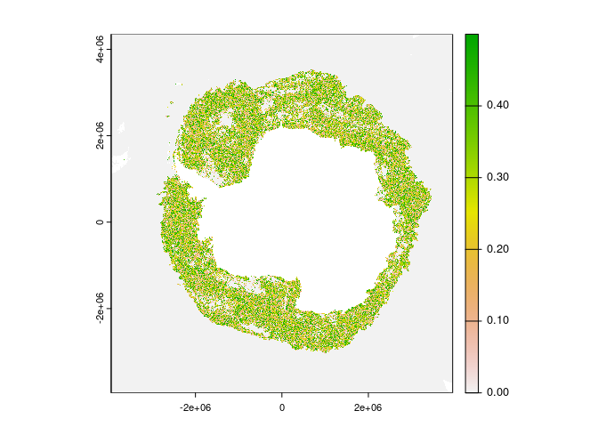

<!-- README.md is generated from README.Rmd. Please edit that file -->

# raadle.humm

<!-- badges: start -->
<!-- badges: end -->

The goal of raadle.humm is to …

## Example

This is a basic example which shows you how to solve a common problem:

``` r
datadir <- normalizePath(file.path("~", "bower_dir"), mustWork = FALSE) #"/bower"
print(datadir)
#> [1] "/home/runner/bower_dir"
print(here::here("data-raw"))
#> [1] "/home/runner/work/raadle.humm/raadle.humm/data-raw"
fs::dir_ls(datadir, recurse = TRUE)
#> /home/runner/bower_dir/seaice.uni-bremen.de
#> /home/runner/bower_dir/seaice.uni-bremen.de/data
#> /home/runner/bower_dir/seaice.uni-bremen.de/data/amsr2
#> /home/runner/bower_dir/seaice.uni-bremen.de/data/amsr2/asi_daygrid_swath
#> /home/runner/bower_dir/seaice.uni-bremen.de/data/amsr2/asi_daygrid_swath/s3125
#> /home/runner/bower_dir/seaice.uni-bremen.de/data/amsr2/asi_daygrid_swath/s3125/2023
#> /home/runner/bower_dir/seaice.uni-bremen.de/data/amsr2/asi_daygrid_swath/s3125/2023/jul
#> /home/runner/bower_dir/seaice.uni-bremen.de/data/amsr2/asi_daygrid_swath/s3125/2023/jul/Antarctic3125
#> /home/runner/bower_dir/seaice.uni-bremen.de/data/amsr2/asi_daygrid_swath/s3125/2023/jul/Antarctic3125/asi-AMSR2-s3125-20230701-v5.4.hdf
#> /home/runner/bower_dir/seaice.uni-bremen.de/data/amsr2/asi_daygrid_swath/s3125/2023/jul/Antarctic3125/asi-AMSR2-s3125-20230701-v5.4.tif
#> /home/runner/bower_dir/seaice.uni-bremen.de/data/amsr2/asi_daygrid_swath/s3125/2023/jul/Antarctic3125/asi-AMSR2-s3125-20230701-v5.hdf
#> /home/runner/bower_dir/seaice.uni-bremen.de/data/amsr2/asi_daygrid_swath/s3125/2023/jul/Antarctic3125/asi-AMSR2-s3125-20230701-v5.tif
#> /home/runner/bower_dir/seaice.uni-bremen.de/data/amsr2/asi_daygrid_swath/s3125/2023/jul/Antarctic3125/asi-AMSR2-s3125-20230702-v5.4.hdf
#> /home/runner/bower_dir/seaice.uni-bremen.de/data/amsr2/asi_daygrid_swath/s3125/2023/jul/Antarctic3125/asi-AMSR2-s3125-20230702-v5.4.tif
#> /home/runner/bower_dir/seaice.uni-bremen.de/data/amsr2/asi_daygrid_swath/s3125/2023/jul/Antarctic3125/asi-AMSR2-s3125-20230702-v5.hdf
#> /home/runner/bower_dir/seaice.uni-bremen.de/data/amsr2/asi_daygrid_swath/s3125/2023/jul/Antarctic3125/asi-AMSR2-s3125-20230702-v5.tif
#> /home/runner/bower_dir/seaice.uni-bremen.de/data/amsr2/asi_daygrid_swath/s3125/2023/jul/Antarctic3125/asi-AMSR2-s3125-20230703-v5.4.hdf
#> /home/runner/bower_dir/seaice.uni-bremen.de/data/amsr2/asi_daygrid_swath/s3125/2023/jul/Antarctic3125/asi-AMSR2-s3125-20230703-v5.4.tif
#> /home/runner/bower_dir/seaice.uni-bremen.de/data/amsr2/asi_daygrid_swath/s3125/2023/jul/Antarctic3125/asi-AMSR2-s3125-20230703-v5.hdf
#> /home/runner/bower_dir/seaice.uni-bremen.de/data/amsr2/asi_daygrid_swath/s3125/2023/jul/Antarctic3125/asi-AMSR2-s3125-20230703-v5.tif
#> /home/runner/bower_dir/seaice.uni-bremen.de/data/amsr2/asi_daygrid_swath/s3125/2023/jul/Antarctic3125/asi-AMSR2-s3125-20230704-v5.4.hdf
#> /home/runner/bower_dir/seaice.uni-bremen.de/data/amsr2/asi_daygrid_swath/s3125/2023/jul/Antarctic3125/asi-AMSR2-s3125-20230704-v5.4.tif
#> /home/runner/bower_dir/seaice.uni-bremen.de/data/amsr2/asi_daygrid_swath/s3125/2023/jul/Antarctic3125/asi-AMSR2-s3125-20230704-v5.hdf
#> /home/runner/bower_dir/seaice.uni-bremen.de/data/amsr2/asi_daygrid_swath/s3125/2023/jul/Antarctic3125/asi-AMSR2-s3125-20230704-v5.tif
#> /home/runner/bower_dir/seaice.uni-bremen.de/data/amsr2/asi_daygrid_swath/s3125/2023/jul/Antarctic3125/asi-AMSR2-s3125-20230705-v5.4.hdf
#> /home/runner/bower_dir/seaice.uni-bremen.de/data/amsr2/asi_daygrid_swath/s3125/2023/jul/Antarctic3125/asi-AMSR2-s3125-20230705-v5.4.tif
#> /home/runner/bower_dir/seaice.uni-bremen.de/data/amsr2/asi_daygrid_swath/s3125/2023/jul/Antarctic3125/asi-AMSR2-s3125-20230705-v5.hdf
#> /home/runner/bower_dir/seaice.uni-bremen.de/data/amsr2/asi_daygrid_swath/s3125/2023/jul/Antarctic3125/asi-AMSR2-s3125-20230705-v5.tif
#> /home/runner/bower_dir/seaice.uni-bremen.de/data/amsr2/asi_daygrid_swath/s3125/2023/jul/Antarctic3125/asi-AMSR2-s3125-20230706-v5.4.hdf
#> /home/runner/bower_dir/seaice.uni-bremen.de/data/amsr2/asi_daygrid_swath/s3125/2023/jul/Antarctic3125/asi-AMSR2-s3125-20230706-v5.4.tif
#> /home/runner/bower_dir/seaice.uni-bremen.de/data/amsr2/asi_daygrid_swath/s3125/2023/jul/Antarctic3125/asi-AMSR2-s3125-20230706-v5.hdf
#> /home/runner/bower_dir/seaice.uni-bremen.de/data/amsr2/asi_daygrid_swath/s3125/2023/jul/Antarctic3125/asi-AMSR2-s3125-20230706-v5.tif
#> /home/runner/bower_dir/seaice.uni-bremen.de/data/amsr2/asi_daygrid_swath/s3125/2023/jul/Antarctic3125/asi-AMSR2-s3125-20230707-v5.4.hdf
#> /home/runner/bower_dir/seaice.uni-bremen.de/data/amsr2/asi_daygrid_swath/s3125/2023/jul/Antarctic3125/asi-AMSR2-s3125-20230707-v5.4.tif
#> /home/runner/bower_dir/seaice.uni-bremen.de/data/amsr2/asi_daygrid_swath/s3125/2023/jul/Antarctic3125/asi-AMSR2-s3125-20230707-v5.hdf
#> /home/runner/bower_dir/seaice.uni-bremen.de/data/amsr2/asi_daygrid_swath/s3125/2023/jul/Antarctic3125/asi-AMSR2-s3125-20230707-v5.tif
#> /home/runner/bower_dir/seaice.uni-bremen.de/data/amsr2/asi_daygrid_swath/s3125/2023/jul/Antarctic3125/asi-AMSR2-s3125-20230708-v5.4.hdf
#> /home/runner/bower_dir/seaice.uni-bremen.de/data/amsr2/asi_daygrid_swath/s3125/2023/jul/Antarctic3125/asi-AMSR2-s3125-20230708-v5.4.tif
#> /home/runner/bower_dir/seaice.uni-bremen.de/data/amsr2/asi_daygrid_swath/s3125/2023/jul/Antarctic3125/asi-AMSR2-s3125-20230708-v5.hdf
#> /home/runner/bower_dir/seaice.uni-bremen.de/data/amsr2/asi_daygrid_swath/s3125/2023/jul/Antarctic3125/asi-AMSR2-s3125-20230708-v5.tif
#> /home/runner/bower_dir/seaice.uni-bremen.de/data/amsr2/asi_daygrid_swath/s3125/2023/jul/Antarctic3125/asi-AMSR2-s3125-20230709-v5.4.hdf
#> /home/runner/bower_dir/seaice.uni-bremen.de/data/amsr2/asi_daygrid_swath/s3125/2023/jul/Antarctic3125/asi-AMSR2-s3125-20230709-v5.4.tif
#> /home/runner/bower_dir/seaice.uni-bremen.de/data/amsr2/asi_daygrid_swath/s3125/2023/jul/Antarctic3125/asi-AMSR2-s3125-20230709-v5.hdf
#> /home/runner/bower_dir/seaice.uni-bremen.de/data/amsr2/asi_daygrid_swath/s3125/2023/jul/Antarctic3125/asi-AMSR2-s3125-20230709-v5.tif
#> /home/runner/bower_dir/seaice.uni-bremen.de/data/amsr2/asi_daygrid_swath/s3125/2023/jul/Antarctic3125/asi-AMSR2-s3125-20230710-v5.4.hdf
#> /home/runner/bower_dir/seaice.uni-bremen.de/data/amsr2/asi_daygrid_swath/s3125/2023/jul/Antarctic3125/asi-AMSR2-s3125-20230710-v5.4.tif
#> /home/runner/bower_dir/seaice.uni-bremen.de/data/amsr2/asi_daygrid_swath/s3125/2023/jul/Antarctic3125/asi-AMSR2-s3125-20230710-v5.hdf
#> /home/runner/bower_dir/seaice.uni-bremen.de/data/amsr2/asi_daygrid_swath/s3125/2023/jul/Antarctic3125/asi-AMSR2-s3125-20230710-v5.tif
#> /home/runner/bower_dir/seaice.uni-bremen.de/data/amsr2/asi_daygrid_swath/s3125/2023/jul/Antarctic3125/asi-AMSR2-s3125-20230711-v5.4.hdf
#> /home/runner/bower_dir/seaice.uni-bremen.de/data/amsr2/asi_daygrid_swath/s3125/2023/jul/Antarctic3125/asi-AMSR2-s3125-20230711-v5.4.tif
#> /home/runner/bower_dir/seaice.uni-bremen.de/data/amsr2/asi_daygrid_swath/s3125/2023/jul/Antarctic3125/asi-AMSR2-s3125-20230711-v5.hdf
#> /home/runner/bower_dir/seaice.uni-bremen.de/data/amsr2/asi_daygrid_swath/s3125/2023/jul/Antarctic3125/asi-AMSR2-s3125-20230711-v5.tif
#> /home/runner/bower_dir/seaice.uni-bremen.de/data/amsr2/asi_daygrid_swath/s3125/2023/jul/Antarctic3125/asi-AMSR2-s3125-20230712-v5.4.hdf
#> /home/runner/bower_dir/seaice.uni-bremen.de/data/amsr2/asi_daygrid_swath/s3125/2023/jul/Antarctic3125/asi-AMSR2-s3125-20230712-v5.4.tif
#> /home/runner/bower_dir/seaice.uni-bremen.de/data/amsr2/asi_daygrid_swath/s3125/2023/jul/Antarctic3125/asi-AMSR2-s3125-20230712-v5.hdf
#> /home/runner/bower_dir/seaice.uni-bremen.de/data/amsr2/asi_daygrid_swath/s3125/2023/jul/Antarctic3125/asi-AMSR2-s3125-20230712-v5.tif
#> /home/runner/bower_dir/seaice.uni-bremen.de/data/amsr2/asi_daygrid_swath/s3125/2023/jul/Antarctic3125/asi-AMSR2-s3125-20230713-v5.4.hdf
#> /home/runner/bower_dir/seaice.uni-bremen.de/data/amsr2/asi_daygrid_swath/s3125/2023/jul/Antarctic3125/asi-AMSR2-s3125-20230713-v5.4.tif
#> /home/runner/bower_dir/seaice.uni-bremen.de/data/amsr2/asi_daygrid_swath/s3125/2023/jul/Antarctic3125/asi-AMSR2-s3125-20230713-v5.hdf
#> /home/runner/bower_dir/seaice.uni-bremen.de/data/amsr2/asi_daygrid_swath/s3125/2023/jul/Antarctic3125/asi-AMSR2-s3125-20230713-v5.tif
#> /home/runner/bower_dir/seaice.uni-bremen.de/data/amsr2/asi_daygrid_swath/s3125/2023/jul/Antarctic3125/asi-AMSR2-s3125-20230714-v5.4.hdf
#> /home/runner/bower_dir/seaice.uni-bremen.de/data/amsr2/asi_daygrid_swath/s3125/2023/jul/Antarctic3125/asi-AMSR2-s3125-20230714-v5.4.tif
#> /home/runner/bower_dir/seaice.uni-bremen.de/data/amsr2/asi_daygrid_swath/s3125/2023/jul/Antarctic3125/asi-AMSR2-s3125-20230714-v5.hdf
#> /home/runner/bower_dir/seaice.uni-bremen.de/data/amsr2/asi_daygrid_swath/s3125/2023/jul/Antarctic3125/asi-AMSR2-s3125-20230714-v5.tif
#> /home/runner/bower_dir/seaice.uni-bremen.de/data/amsr2/asi_daygrid_swath/s3125/2023/jul/Antarctic3125/asi-AMSR2-s3125-20230715-v5.4.hdf
#> /home/runner/bower_dir/seaice.uni-bremen.de/data/amsr2/asi_daygrid_swath/s3125/2023/jul/Antarctic3125/asi-AMSR2-s3125-20230715-v5.4.tif
#> /home/runner/bower_dir/seaice.uni-bremen.de/data/amsr2/asi_daygrid_swath/s3125/2023/jul/Antarctic3125/asi-AMSR2-s3125-20230715-v5.hdf
#> /home/runner/bower_dir/seaice.uni-bremen.de/data/amsr2/asi_daygrid_swath/s3125/2023/jul/Antarctic3125/asi-AMSR2-s3125-20230715-v5.tif
#> /home/runner/bower_dir/seaice.uni-bremen.de/data/amsr2/asi_daygrid_swath/s3125/2023/jul/Antarctic3125/asi-AMSR2-s3125-20230716-v5.4.hdf
#> /home/runner/bower_dir/seaice.uni-bremen.de/data/amsr2/asi_daygrid_swath/s3125/2023/jul/Antarctic3125/asi-AMSR2-s3125-20230716-v5.4.tif
#> /home/runner/bower_dir/seaice.uni-bremen.de/data/amsr2/asi_daygrid_swath/s3125/2023/jul/Antarctic3125/asi-AMSR2-s3125-20230716-v5.hdf
#> /home/runner/bower_dir/seaice.uni-bremen.de/data/amsr2/asi_daygrid_swath/s3125/2023/jul/Antarctic3125/asi-AMSR2-s3125-20230716-v5.tif
#> /home/runner/bower_dir/seaice.uni-bremen.de/data/amsr2/asi_daygrid_swath/s3125/2023/jul/Antarctic3125/asi-AMSR2-s3125-20230717-v5.4.hdf
#> /home/runner/bower_dir/seaice.uni-bremen.de/data/amsr2/asi_daygrid_swath/s3125/2023/jul/Antarctic3125/asi-AMSR2-s3125-20230717-v5.4.tif
#> /home/runner/bower_dir/seaice.uni-bremen.de/data/amsr2/asi_daygrid_swath/s3125/2023/jul/Antarctic3125/asi-AMSR2-s3125-20230717-v5.hdf
#> /home/runner/bower_dir/seaice.uni-bremen.de/data/amsr2/asi_daygrid_swath/s3125/2023/jul/Antarctic3125/asi-AMSR2-s3125-20230717-v5.tif
#> /home/runner/bower_dir/seaice.uni-bremen.de/data/amsr2/asi_daygrid_swath/s3125/2023/jul/Antarctic3125/asi-AMSR2-s3125-20230718-v5.4.hdf
#> /home/runner/bower_dir/seaice.uni-bremen.de/data/amsr2/asi_daygrid_swath/s3125/2023/jul/Antarctic3125/asi-AMSR2-s3125-20230718-v5.4.tif
#> /home/runner/bower_dir/seaice.uni-bremen.de/data/amsr2/asi_daygrid_swath/s3125/2023/jul/Antarctic3125/asi-AMSR2-s3125-20230718-v5.hdf
#> /home/runner/bower_dir/seaice.uni-bremen.de/data/amsr2/asi_daygrid_swath/s3125/2023/jul/Antarctic3125/asi-AMSR2-s3125-20230718-v5.tif
#> /home/runner/bower_dir/seaice.uni-bremen.de/data/amsr2/asi_daygrid_swath/s3125/2023/jul/Antarctic3125/asi-AMSR2-s3125-20230719-v5.4.hdf
#> /home/runner/bower_dir/seaice.uni-bremen.de/data/amsr2/asi_daygrid_swath/s3125/2023/jul/Antarctic3125/asi-AMSR2-s3125-20230719-v5.4.tif
#> /home/runner/bower_dir/seaice.uni-bremen.de/data/amsr2/asi_daygrid_swath/s3125/2023/jul/Antarctic3125/asi-AMSR2-s3125-20230719-v5.hdf
#> /home/runner/bower_dir/seaice.uni-bremen.de/data/amsr2/asi_daygrid_swath/s3125/2023/jul/Antarctic3125/asi-AMSR2-s3125-20230719-v5.tif
#> /home/runner/bower_dir/seaice.uni-bremen.de/data/amsr2/asi_daygrid_swath/s3125/2023/jul/Antarctic3125/asi-AMSR2-s3125-20230720-v5.4.hdf
#> /home/runner/bower_dir/seaice.uni-bremen.de/data/amsr2/asi_daygrid_swath/s3125/2023/jul/Antarctic3125/asi-AMSR2-s3125-20230720-v5.4.tif
#> /home/runner/bower_dir/seaice.uni-bremen.de/data/amsr2/asi_daygrid_swath/s3125/2023/jul/Antarctic3125/asi-AMSR2-s3125-20230720-v5.hdf
#> /home/runner/bower_dir/seaice.uni-bremen.de/data/amsr2/asi_daygrid_swath/s3125/2023/jul/Antarctic3125/asi-AMSR2-s3125-20230720-v5.tif
#> /home/runner/bower_dir/seaice.uni-bremen.de/data/amsr2/asi_daygrid_swath/s3125/2023/jul/Antarctic3125/asi-AMSR2-s3125-20230721-v5.4.hdf
#> /home/runner/bower_dir/seaice.uni-bremen.de/data/amsr2/asi_daygrid_swath/s3125/2023/jul/Antarctic3125/asi-AMSR2-s3125-20230721-v5.4.tif
#> /home/runner/bower_dir/seaice.uni-bremen.de/data/amsr2/asi_daygrid_swath/s3125/2023/jul/Antarctic3125/asi-AMSR2-s3125-20230721-v5.hdf
#> /home/runner/bower_dir/seaice.uni-bremen.de/data/amsr2/asi_daygrid_swath/s3125/2023/jul/Antarctic3125/asi-AMSR2-s3125-20230721-v5.tif
#> /home/runner/bower_dir/seaice.uni-bremen.de/data/amsr2/asi_daygrid_swath/s3125/2023/jul/Antarctic3125/asi-AMSR2-s3125-20230722-v5.4.hdf
#> /home/runner/bower_dir/seaice.uni-bremen.de/data/amsr2/asi_daygrid_swath/s3125/2023/jul/Antarctic3125/asi-AMSR2-s3125-20230722-v5.4.tif
#> /home/runner/bower_dir/seaice.uni-bremen.de/data/amsr2/asi_daygrid_swath/s3125/2023/jul/Antarctic3125/asi-AMSR2-s3125-20230722-v5.hdf
#> /home/runner/bower_dir/seaice.uni-bremen.de/data/amsr2/asi_daygrid_swath/s3125/2023/jul/Antarctic3125/asi-AMSR2-s3125-20230722-v5.tif
#> /home/runner/bower_dir/seaice.uni-bremen.de/data/amsr2/asi_daygrid_swath/s3125/2023/jul/Antarctic3125/asi-AMSR2-s3125-20230723-v5.4.hdf
#> /home/runner/bower_dir/seaice.uni-bremen.de/data/amsr2/asi_daygrid_swath/s3125/2023/jul/Antarctic3125/asi-AMSR2-s3125-20230723-v5.4.tif
#> /home/runner/bower_dir/seaice.uni-bremen.de/data/amsr2/asi_daygrid_swath/s3125/2023/jul/Antarctic3125/asi-AMSR2-s3125-20230723-v5.hdf
#> /home/runner/bower_dir/seaice.uni-bremen.de/data/amsr2/asi_daygrid_swath/s3125/2023/jul/Antarctic3125/asi-AMSR2-s3125-20230723-v5.tif
#> /home/runner/bower_dir/seaice.uni-bremen.de/data/amsr2/asi_daygrid_swath/s3125/2023/jul/Antarctic3125/asi-AMSR2-s3125-20230724-v5.4.hdf
#> /home/runner/bower_dir/seaice.uni-bremen.de/data/amsr2/asi_daygrid_swath/s3125/2023/jul/Antarctic3125/asi-AMSR2-s3125-20230724-v5.4.tif
#> /home/runner/bower_dir/seaice.uni-bremen.de/data/amsr2/asi_daygrid_swath/s3125/2023/jul/Antarctic3125/asi-AMSR2-s3125-20230724-v5.hdf
#> /home/runner/bower_dir/seaice.uni-bremen.de/data/amsr2/asi_daygrid_swath/s3125/2023/jul/Antarctic3125/asi-AMSR2-s3125-20230724-v5.tif
#> /home/runner/bower_dir/seaice.uni-bremen.de/data/amsr2/asi_daygrid_swath/s3125/2023/jul/Antarctic3125/asi-AMSR2-s3125-20230725-v5.4.hdf
#> /home/runner/bower_dir/seaice.uni-bremen.de/data/amsr2/asi_daygrid_swath/s3125/2023/jul/Antarctic3125/asi-AMSR2-s3125-20230725-v5.4.tif
#> /home/runner/bower_dir/seaice.uni-bremen.de/data/amsr2/asi_daygrid_swath/s3125/2023/jul/Antarctic3125/asi-AMSR2-s3125-20230725-v5.hdf
#> /home/runner/bower_dir/seaice.uni-bremen.de/data/amsr2/asi_daygrid_swath/s3125/2023/jul/Antarctic3125/asi-AMSR2-s3125-20230725-v5.tif
```

These are weird files because they are fairly hopeless HDF4Image with no
metadata and GeoTIFFs with Byte values with a colour table. Happily the
byte values are 8-bit integers between 0 and 120, with 0 and 120 being
special values for zero and land. In the colour table zero is blue (139)
and land is grey (100). All other values 1:100 are a guady spectrum, so
we just use the numbers.

Process to a raster data set.

``` r
library(dplyr)
#> 
#> Attaching package: 'dplyr'
#> The following objects are masked from 'package:stats':
#> 
#>     filter, lag
#> The following objects are masked from 'package:base':
#> 
#>     intersect, setdiff, setequal, union
library(terra)
#> terra 1.7.39
files <- tibble::tibble(fullname = fs::dir_ls("~/bower_dir/", recurse = T, regexp = ".*(tif|hdf)$"))

hdfiles <- files |> filter(grepl(".*hdf$", fullname))
files <- files |> filter(grepl(".*tif$", fullname))


r <- rast(files$fullname[nrow(files)])
coltab(r) <- NULL
r[r > 100] <- NA
plot(r, col = hcl.colors(101))
contour(r, level = 15, add = T, lwd = 2)
```


Or, with the HDF we get sub-integer values we just need to use the
georef from the tif.

``` r
hdf <- rast(hdfiles$fullname[nrow(hdfiles)])
#> Warning: [rast] unknown extent

set.ext(hdf, ext(r))
set.crs(hdf, crs(r))
hdf <- flip(hdf)
plot(r)
contour(hdf, add = TRUE, lwd = 2, level = 15)
```


``` r
plot(abs(r - hdf))  ## see there is sub-integer information (do we care?)
```


