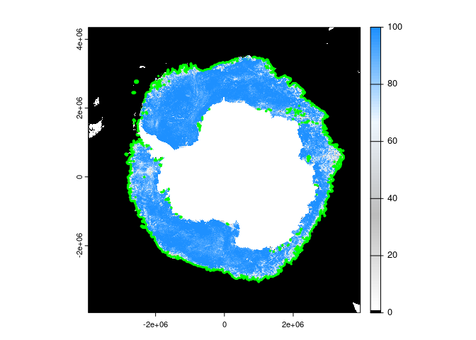

<!-- README.md is generated from README.Rmd. Please edit that file -->

# idea.sources00

<!-- badges: start -->
<!-- badges: end -->

The goal of idea.sources00 is to get data with IDEA tools, see script in
data-raw/ this is triggered by github actions.

## Example

This is a basic example which shows you how to solve a common problem:

``` r
## this was set in the data-raw/run.R job
datadir <- normalizePath(file.path("~", "bower_dir"), mustWork = FALSE) 
print(datadir)
#> [1] "/home/runner/bower_dir"
```

These are weird files … there is an HDF4Image with no metadata and
GeoTIFFs with Byte values with a colour table. Happily the byte values
are 8-bit integers between 0 and 120, with 0 and 120 being special
values for zero and land. In the colour table zero is blue (139) and
land is grey (100). All other values 1:100 are a guady spectrum, so we
just use the numbers.

Process to a raster data set.

``` r
library(dplyr)
#> 
#> Attaching package: 'dplyr'
#> The following objects are masked from 'package:stats':
#> 
#>     filter, lag
#> The following objects are masked from 'package:base':
#> 
#>     intersect, setdiff, setequal, union
library(terra)
#> terra 1.7.46
files <- tibble::tibble(fullname = fs::dir_ls("~/bower_dir/", recurse = T, regexp = ".*(tif|hdf)$"))
print(files)
#> # A tibble: 8 × 1
#>   fullname                                                                      
#>   <fs::path>                                                                    
#> 1 …_daygrid_swath/s3125/2023/sep/Antarctic3125/asi-AMSR2-s3125-20230910-v5.4.hdf
#> 2 …_daygrid_swath/s3125/2023/sep/Antarctic3125/asi-AMSR2-s3125-20230910-v5.4.tif
#> 3 …_daygrid_swath/s3125/2023/sep/Antarctic3125/asi-AMSR2-s3125-20230911-v5.4.hdf
#> 4 …_daygrid_swath/s3125/2023/sep/Antarctic3125/asi-AMSR2-s3125-20230911-v5.4.tif
#> 5 …_daygrid_swath/s3125/2023/sep/Antarctic3125/asi-AMSR2-s3125-20230912-v5.4.hdf
#> 6 …_daygrid_swath/s3125/2023/sep/Antarctic3125/asi-AMSR2-s3125-20230912-v5.4.tif
#> 7 …_daygrid_swath/s3125/2023/sep/Antarctic3125/asi-AMSR2-s3125-20230913-v5.4.hdf
#> 8 …_daygrid_swath/s3125/2023/sep/Antarctic3125/asi-AMSR2-s3125-20230913-v5.4.tif
hdfiles <- files |> filter(grepl(".*hdf$", fullname))
files <- files |> filter(grepl(".*tif$", fullname))


r <- rast(files$fullname[nrow(files)])
date <- as.Date(strptime(stringr::str_extract(basename(files$fullname[nrow(files)]), "[0-9]{8}"), "%Y%m%d"))
coltab(r) <- NULL
r[r > 100] <- NA
plot(r, col = hcl.colors(101))
title(sprintf("Antarctic sea ice %s (AMSR 3152m)", format(date)))
contour(r, level = 15, add = T, lwd = 2)
```


Or, with the HDF we get sub-integer values we just need to use the
georef from the tif.

``` r
hdf <- rast(hdfiles$fullname[nrow(hdfiles)])
#> Warning: [rast] unknown extent

set.ext(hdf, ext(r))
set.crs(hdf, crs(r))
hdf <- flip(hdf)
plot(r)
contour(hdf, add = TRUE, lwd = 2, level = 15)
```


``` r
plot(abs(r - hdf))  ## see there is sub-integer information (do we care?)
```


It *seems* to be enough with terra to flip the Y part of the extent, and
we don’t have to go through the warper?

``` r
vrt <- vapour::vapour_vrt(hdfiles$fullname[nrow(hdfiles)], extent = c(-3950000, 3950000, -3950000, 4350000)[c(1, 2, 4, 3)], crs = "EPSG:3976")
plot(rast(vrt), col = c("black", colorRampPalette(c("white", "grey", "aliceblue",  "dodgerblue"))(99)))
contour(r, level = 15, add = TRUE, col = "green", lwd = 3)
```



## HDF4Image

gdalinfo on the HDF files gives this

    bower_dir/seaice.uni-bremen.de/data/amsr2/asi_daygrid_swath/s3125/2023/jul/Antarctic3125/asi-AMSR2-s3125-20230708-v5.hdf
    Size is 2528, 2656
    Metadata:
      grid_information=longitude-latitude grid for these data to be found at: https://seaice.uni-bremen.de/data/grid_coordinates/s3125/
      long_name=ASI Ice Concentration, Version: 5.4, 20230708, res: 3.12500, AMSR2, Region: Antarctic3125
      valid_range=0, 100
    Corner Coordinates:
    Upper Left  (    0.0,    0.0)
    Lower Left  (    0.0, 2656.0)
    Upper Right ( 2528.0,    0.0)
    Lower Right ( 2528.0, 2656.0)
    Center      ( 1264.0, 1328.0)
    Band 1 Block=2528x395 Type=Float32, ColorInterp=Gray

So, we can get coordinates like this

``` bash
wget https://seaice.uni-bremen.de/data/grid_coordinates/s3125/LongitudeLatitudeGrid-s3125-Antarctic3125.hdf

gdalinfo LongitudeLatitudeGrid-s3125-Antarctic3125.hdf
Driver: HDF4/Hierarchical Data Format Release 4
Files: LongitudeLatitudeGrid-s3125-Antarctic3125.hdf
Size is 512, 512
Subdatasets:
  SUBDATASET_1_NAME=HDF4_SDS:UNKNOWN:"LongitudeLatitudeGrid-s3125-Antarctic3125.hdf":0
  SUBDATASET_1_DESC=[2656x2528] Longitudes (32-bit floating-point)
  SUBDATASET_2_NAME=HDF4_SDS:UNKNOWN:"LongitudeLatitudeGrid-s3125-Antarctic3125.hdf":1
  SUBDATASET_2_DESC=[2656x2528] Latitudes (32-bit floating-point)
Corner Coordinates:
Upper Left  (    0.0,    0.0)
Lower Left  (    0.0,  512.0)
Upper Right (  512.0,    0.0)
Lower Right (  512.0,  512.0)
Center      (  256.0,  256.0)
```

But, why bother with that … the georeferencing is four numbers and a
string:

``` r
extent <- c(-3950000, 3950000, -3950000, 4350000)
aullr <- extent[c(1, 4, 2, 3)]

crs <- "EPSG:3976"
```

We can convert the HDF4Image to GeoTIFF with

``` bash
gdal_translate asi-AMSR2-s3125-20230708-v5.hdf -a_ullr -3950000  -3950000 3950000 4350000 -a_srs "EPSG:3976" asi-AMSR2-s3125-20230708-v5_data.vrt
gdalwarp   asi-AMSR2-s3125-20230708-v5_data.vrt   asi-AMSR2-s3125-20230708-v5_data.tif -co COMPRESS=LZW -co PREDICTOR=3 -co BLOCKXSIZE=2528 -co BLOCKYSIZE=395
rm asi-AMSR2-s3125-20230708-v5_data.vrt
```

This results in a 4.2Mb GeoTIFF, with the same internal values and
tiling as the HDF4.

To do that more directly and in R, with GDAL \>=3.7.0 we can do this

``` r
dsn <- sprintf("vrt://%s?a_ullr=-3950000,-3950000,3950000,4350000&a_srs=EPSG:3976",  hdfiles$fullname[nrow(hdfiles)])
vapour::vapour_raster_info(dsn)$geotransform
## -3950000     3125        0 -3950000        0     3125

#then downstream use resolves correctly
```
