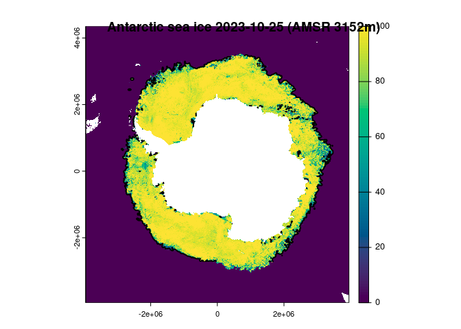

<!-- README.md is generated from README.Rmd. Please edit that file -->

# idea.sources00

<!-- badges: start -->
<!-- badges: end -->

The goal of idea.sources00 is to get data with IDEA tools, see script in
data-raw/ this is triggered by github actions.

## Example

This is a basic example which shows you how to solve a common problem:

``` r
## this was set in the data-raw/run.R job
datadir <- normalizePath(file.path("~", "bower_dir"), mustWork = FALSE) 
print(datadir)
#> [1] "/home/runner/bower_dir"
```

These are weird files because they are fairly hopeless HDF4Image with no
metadata and GeoTIFFs with Byte values with a colour table. Happily the
byte values are 8-bit integers between 0 and 120, with 0 and 120 being
special values for zero and land. In the colour table zero is blue (139)
and land is grey (100). All other values 1:100 are a guady spectrum, so
we just use the numbers.

Process to a raster data set.

``` r
library(dplyr)
#> 
#> Attaching package: 'dplyr'
#> The following objects are masked from 'package:stats':
#> 
#>     filter, lag
#> The following objects are masked from 'package:base':
#> 
#>     intersect, setdiff, setequal, union
library(terra)
#> terra 1.7.39
files <- tibble::tibble(fullname = fs::dir_ls("~/bower_dir/", recurse = T, regexp = ".*(tif|hdf)$"))
print(files)
#> # A tibble: 40 × 1
#>    fullname                                                                     
#>    <fs::path>                                                                   
#>  1 …daygrid_swath/s3125/2023/jul/Antarctic3125/asi-AMSR2-s3125-20230716-v5.4.hdf
#>  2 …daygrid_swath/s3125/2023/jul/Antarctic3125/asi-AMSR2-s3125-20230716-v5.4.tif
#>  3 …i_daygrid_swath/s3125/2023/jul/Antarctic3125/asi-AMSR2-s3125-20230716-v5.hdf
#>  4 …i_daygrid_swath/s3125/2023/jul/Antarctic3125/asi-AMSR2-s3125-20230716-v5.tif
#>  5 …daygrid_swath/s3125/2023/jul/Antarctic3125/asi-AMSR2-s3125-20230717-v5.4.hdf
#>  6 …daygrid_swath/s3125/2023/jul/Antarctic3125/asi-AMSR2-s3125-20230717-v5.4.tif
#>  7 …i_daygrid_swath/s3125/2023/jul/Antarctic3125/asi-AMSR2-s3125-20230717-v5.hdf
#>  8 …i_daygrid_swath/s3125/2023/jul/Antarctic3125/asi-AMSR2-s3125-20230717-v5.tif
#>  9 …daygrid_swath/s3125/2023/jul/Antarctic3125/asi-AMSR2-s3125-20230718-v5.4.hdf
#> 10 …daygrid_swath/s3125/2023/jul/Antarctic3125/asi-AMSR2-s3125-20230718-v5.4.tif
#> # ℹ 30 more rows
hdfiles <- files |> filter(grepl(".*hdf$", fullname))
files <- files |> filter(grepl(".*tif$", fullname))


r <- rast(files$fullname[nrow(files)])
date <- as.Date(strptime(stringr::str_extract(basename(files$fullname[nrow(files)]), "[0-9]{8}"), "%Y%m%d"))
coltab(r) <- NULL
r[r > 100] <- NA
plot(r, col = hcl.colors(101))
title(sprintf("Antarctic sea ice %s (AMSR 3152m)", format(date)))
contour(r, level = 15, add = T, lwd = 2)
```



Or, with the HDF we get sub-integer values we just need to use the
georef from the tif.

``` r
hdf <- rast(hdfiles$fullname[nrow(hdfiles)])
#> Warning: [rast] unknown extent

set.ext(hdf, ext(r))
set.crs(hdf, crs(r))
hdf <- flip(hdf)
plot(r)
contour(hdf, add = TRUE, lwd = 2, level = 15)
```


``` r
plot(abs(r - hdf))  ## see there is sub-integer information (do we care?)
```


It *seems* to be enough with terra to flip the Y part of the extent, and
we don’t have to go through the warper?

``` r
vrt <- vapour::vapour_vrt(hdfiles$fullname[nrow(hdfiles)], extent = c(-3950000, 3950000, -3950000, 4350000)[c(1, 2, 4, 3)], crs = "EPSG:3976")
plot(rast(vrt), col = c("black", colorRampPalette(c("white", "grey", "aliceblue",  "dodgerblue"))(99)))
contour(r, level = 15, add = TRUE, col = "green", lwd = 3)
```


